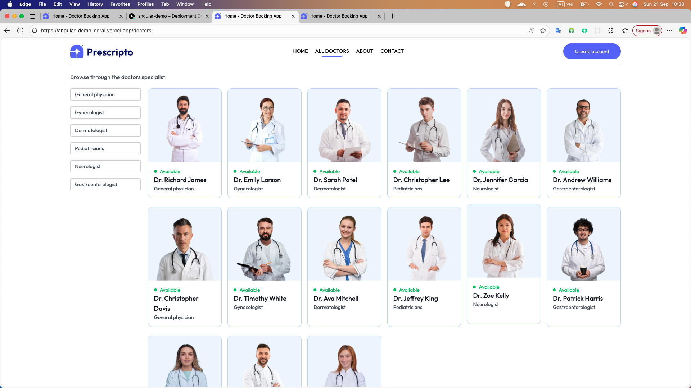
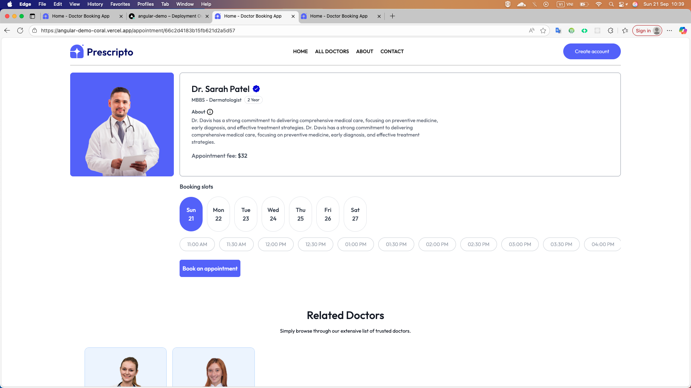
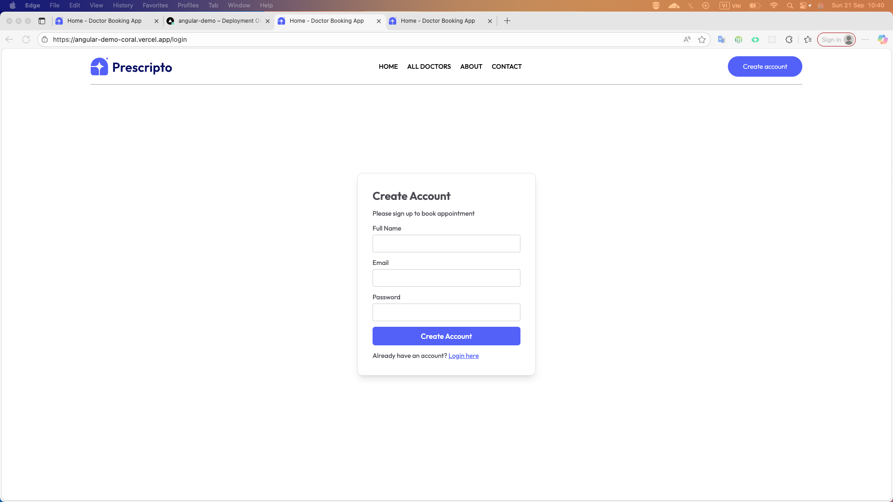
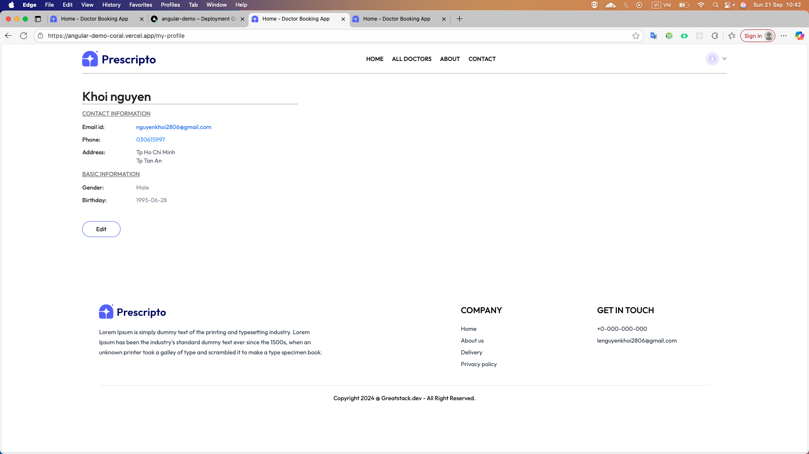
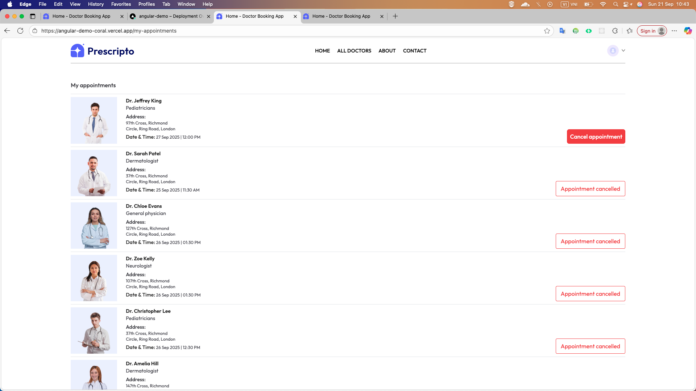

# Prescripto Clone (Angular 20 + TailwindCSS 3)

A modern healthcare appointment booking web app, inspired by prescripto.vercel.app
, built using Angular 20 and TailwindCSS 3.

## Tech Stack

- Angular 20 – Component-based UI framework
- TailwindCSS 3 – Utility-first CSS styling
- TypeScript – Strongly typed JavaScript
- RxJS – Reactive programming for async data streams
- Angular Router – Client-side routing
- Vercel (optional) – Deployment platform

## Installation

```bash
npm install
```

## Deploy in Vercel

<https://angular-demo-coral.vercel.app/>

## Project structure

```bash
├── src
│   ├── app
│   │   ├── components        # Reusable UI components
│   │   ├── layout            # Layout components (Navbar, Footer)
│   │   ├── pages             # Page components (Home, Doctors, Appointment)
│   │   ├── services          # Angular services for API calls
│   │   ├── app-routing.module.ts  # Application routing
│   │   └── app.module.ts     # Root module
│   └── environments
│       ├── environment.development.ts   # Development environment variables
│       └── environment.prod.ts   # Production environment variables
├── public
│   ├── assets                # Static assets (images, fonts)
│   └── index.html            # Main HTML file
├── angular.json             # Angular CLI configuration
├── package.json             # NPM dependencies and scripts
├── tailwind.config.js       # TailwindCSS configuration
└── README.md                # Project documentation
```

## Home


## Doctors by Speciality



## Appointment Booking



## Login



## My profile



## My appointments


